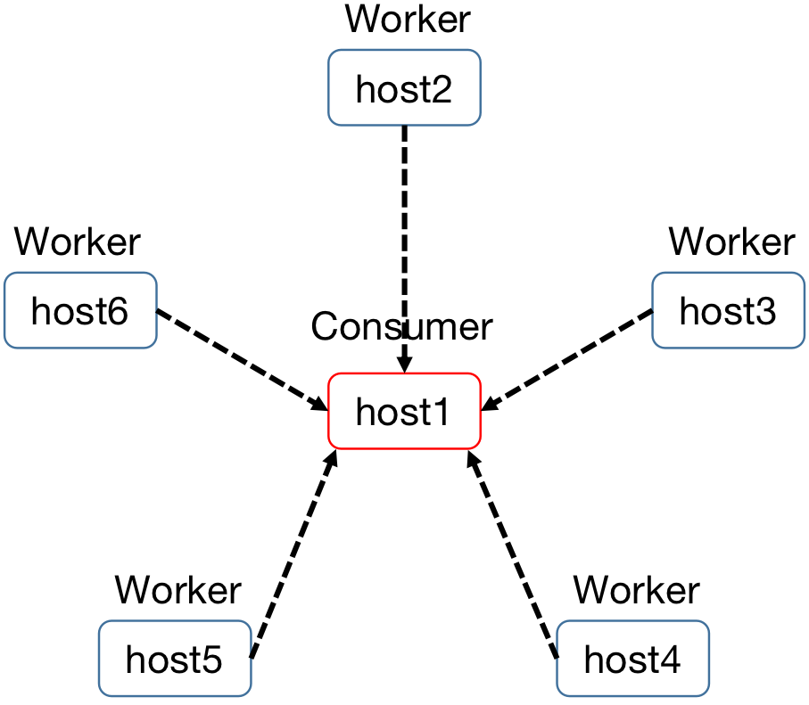
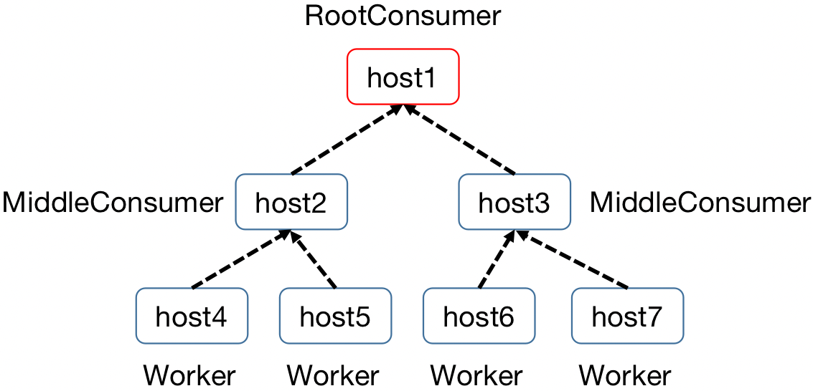
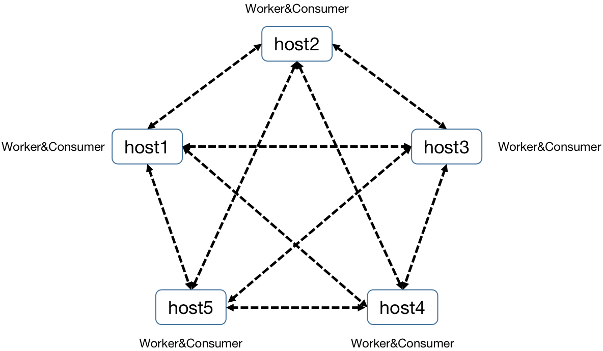

<div align="center">

</div>


# TLaunch: Launch Programs on Multiple Hosts

## Introduction

[Deepmind launchpad](https://github.com/deepmind/launchpad) is a library that
helps writing distributed program in a simple way. But currently it only
supports (or has only open-sourced) launching programs on a single host, either
multi-threaded or multi-processed. This library provides a way of launching existing launchpad programs on multiple
nodes. Only some simple modification to your program is needed.

## Installation

First, let's clone this repository. Then `cd` into the repository, and execute:
``` sh
pip install -r requirements.txt
pip install .
```

## Usage

### 1. Launch programs on multiple hosts without communication
``` python
from absl import app
import logging
from tlaunch import lp_ssh

class Worker:
  def __init__(self, worker_id):
    self.worker_id = worker_id

  def run(self):
    logging.info('Worker {}:{}'.format(self.worker_id, i))
    lp_ssh.stop()

def make_program():
  program = lp_ssh.Program('worker')
  worker_num = 2
  current_num = 0
  for host in ['host1','host2']:
    for i in range(worker_num):
      ssh_node  = lp_ssh.SSHNode(Worker, current_num).to_host(host)
      current_num += 1
      program.add_node(ssh_node, label=host+'_worker')
  lp_ssh.launch(program, terminal='ssh_tmux_session')
def main(_):
  make_program()

if __name__ == '__main__':
  app.run(main)
```
In this code, we place `Worker` on `host1` and `host2` via `to_host()` function. With `lp_ssh.launch()`, 
Each `Worker` will start to run on its corresponding hosts. Besides, [examples/mnist/run.sh](./examples/mnist/run.sh) 
shows an example of how to train MNIST dataset on multiple hosts.

### 2. Launch programs on multiple hosts with communication
[examples/commands/run_cmd.py](./examples/commands/run_cmd.py) gives an example of how to check GPU status 
of remote hosts. The information can be transferred via defining a `TransmitNode`.

### 3. Different data-transfer types

- Star type (see more in [examples/trans_types/star_type.py](./examples/trans_types/star_type.py)):
<p align="center">

</p>

- Tree type (see more in [examples/trans_types/tree_type.py](./examples/trans_types/tree_type.py)):
<p align="center">

</p>

- Net type (see more in [examples/trans_types/net_type.py](./examples/trans_types/net_type.py)):
<p align="center">

</p>

## [Optional] Kubernetes Support

If you want to use TLaunch with Kubernetes:
1. `go` installed on host machine to run `kustomize`. 
2. A running kubernetes cluster. 
3. [Volcano scheduler](https://github.com/volcano-sh/volcano) installed to
   enable gang scheduling. [This](https://volcano.sh/en/docs/installation/) will
   tell you how to install volcano for your kubernetes cluster.

### Install and run `lp-operator` on your kubernetes cluster

``` sh
cd lp-operator
make deploy
```

Then `lp-operator` should be running in namespace `lp-operator-system`. You can
use `kubectl get all -n lp-operator-system` to check the status of the running
operator.

## [Optional] Kubernetes Usage

Check [here](./docs/k8s_usage.md) for more information.

## Citing TLaunch

If you use TLaunch in your work, please cite us:

```bibtex
@article{tartrl2021tlaunch,
    title={TLaunch: Launch Programs on Multiple Hosts},
    author={Shiyu Huang, Sen Na, Shizhen Xu, Ting Chen, Jun Zhu},
    year={2021},
    howpublished={\url{https://github.com/TARTRL/TLaunch}},
}
```
