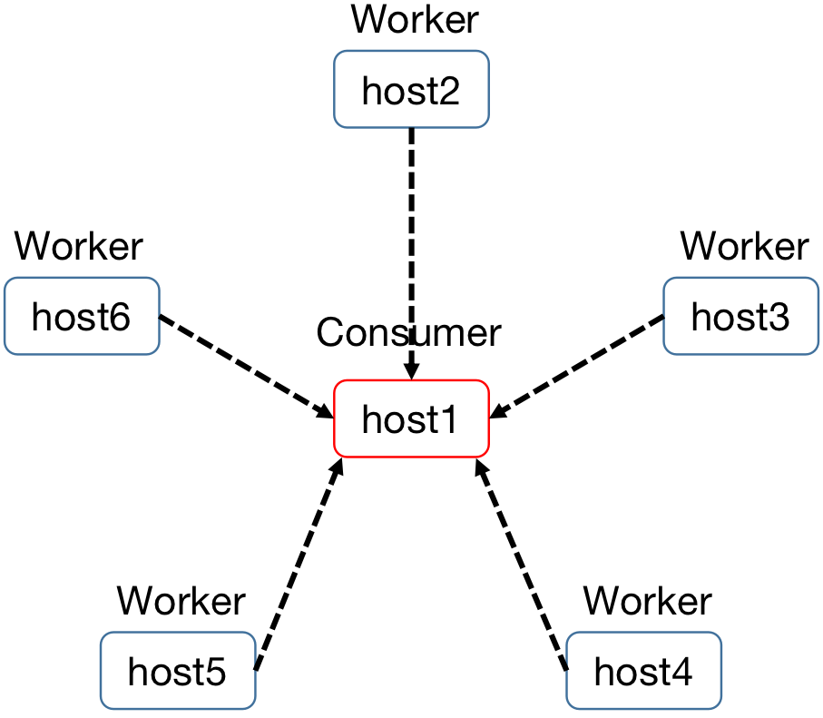
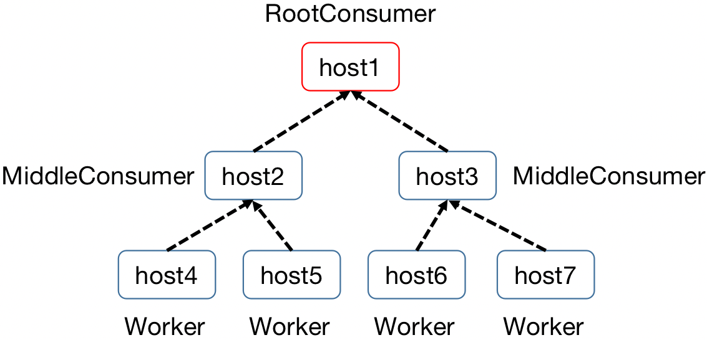
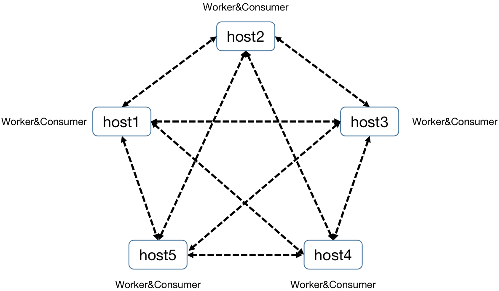

# Quick Start
## SSH
### 1. Launch programs on multiple hosts without communication
``` python
from absl import app
import logging
from tlaunch import lp_ssh

class Worker:
  def __init__(self, worker_id):
    self.worker_id = worker_id

  def run(self):
    logging.info('Worker {}:{}'.format(self.worker_id, i))
    lp_ssh.stop()

def make_program():
  program = lp_ssh.Program('worker')
  worker_num = 2
  current_num = 0
  for host in ['host1','host2']:
    for i in range(worker_num):
      ssh_node  = lp_ssh.SSHNode(Worker, current_num).to_host(host)
      current_num += 1
      program.add_node(ssh_node, label=host+'_worker')
  lp_ssh.launch(program, terminal='ssh_tmux_session')
def main(_):
  make_program()

if __name__ == '__main__':
  app.run(main)
```
In this code, we place `Worker` on `host1` and `host2` via `to_host()` function. With `lp_ssh.launch()`, 
Each `Worker` will start to run on its corresponding hosts. Besides, [examples/mnist/run.sh](./examples/mnist/run.sh) 
shows an example of how to train MNIST dataset on multiple hosts.

### 2. Launch programs on multiple hosts with communication
[examples/commands/run_cmd.py](https://github.com/TARTRL/TLaunch/blob/main/examples/commands/run_cmd.py) gives an example of how to check GPU status 
of remote hosts. The information can be transferred via defining a `TransmitNode`.

### 3. Different data-transfer types

- Star type (see more in [examples/trans_types/star_type.py](https://github.com/TARTRL/TLaunch/blob/main/examples/trans_types/star_type.py)):
<p align="center">

</p>

- Tree type (see more in [examples/trans_types/tree_type.py](https://github.com/TARTRL/TLaunch/blob/main/examples/trans_types/tree_type.py)):
<p align="center">

</p>

- Net type (see more in [examples/trans_types/net_type.py](https://github.com/TARTRL/TLaunch/blob/main/examples/trans_types/net_type.py)):
<p align="center">

</p>

## Kubernetes
After running the operator in the kubernetes cluster, you should be able to use
`lp_k8s` to deploy some launchpad program. Below is a very simple
### 1.Basic Example
example, modified from the `consumer_producer` example on Deepmind launchpad's
[github main page](https://github.com/deepmind/launchpad#implement-example-nodes).

``` python
from absl import app
import logging
import time
import launchpad as lp
import tlaunch.lp_k8s as lp_k8s

class Producer:
  def work(self, context):
    logging.info('I got called, wohoo...')
    time.sleep(30)
    logging.info('I am waking up')
    return context

class Consumer:
  def __init__(self, producers):
    self._producers = producers

  def run(self):
    logging.info('calling workers')
    futures = [producer.futures.work(context)
               for context, producer in enumerate(self._producers)]
    results = [future.result() for future in futures]
    logging.info('Results: %s', results)
    lp_k8s.stop()

def make_program(num_producers):
  program = lp.Program('consumer_producers')
  with program.group('producer'):
    producers = [
        program.add_node(lp.CourierNode(Producer)) for _ in range(num_producers)
    ]
  node = lp.CourierNode(
      Consumer,
      producers=producers)
  program.add_node(node, label='consumer')
  return program

def main(_):
  program = make_program(num_producers=3)
  lp_k8s.launch(program)

if __name__ == '__main__':
  app.run(main)
```

As you can see here, you only need very little modification to your existing
code to launch the program on kubernetes cluster.

`lp_k8s` only provides two functions, that is, `launch` and
`stop`. 

`launch` will create a `LpJob` custom resource on kubernetes, and the
operator will handle the rest, such as creating the pod to run the node
functions and creating the service for communication between pods.

`stop` will send a stop signal to the operator, then the operator would clean
up the `LpJob`.

Basically if you know how to write launchpad program, this is almost exactly the
same.

### 2.Use GPU
We can customize the configuration information by adding a config object for node. For example, when we want to apply gpu resources for node, we can refer to the following example.

```python
import sys
import logging
import subprocess
import xmltodict
from xml.parsers import expat
import launchpad as lp
from tlaunch import lp_k8s
from tlaunch.lp_k8s import Config, Container,Resource

def install(name):
    subprocess.call(['pip', 'install', name])

def get_gpu_status(gpu):
    gpu_id = gpu['minor_number']
    product_name = gpu['product_name']
    memory_total = int(gpu['fb_memory_usage']['total'].split(' ')[0])
    memory_used = int(gpu['fb_memory_usage']['used'].split(' ')[0])
    memory_free = int(gpu['fb_memory_usage']['free'].split(' ')[0])
    return 'GPU:{}\t{}Mb/{}Mb\t{}'.format(gpu_id, memory_used, memory_total, product_name)

def get_gpus():
    log = logging.getLogger()
    log.setLevel(logging.DEBUG)
    cmd = 'nvidia-smi -x -q'
    output = subprocess.getoutput(cmd)
    json = xmltodict.parse(output, expat=expat)
    gpus = json['nvidia_smi_log']['gpu']
    gpu_status = []
    if type(gpus) is list:
        for gpu in gpus:
            gpu_status.append(get_gpu_status(gpu))
    elif type(gpus) is dict:
        gpu_status.append(get_gpu_status(gpus))
    return {'localhost':gpu_status}

class GPUTest:
    def __init__(self):
        pass

    def run(self):
        gpu_status = get_gpus()
        for host in gpu_status:
            logging.getLogger().warning('Host {}:'.format(host))
            for g_s in gpu_status[host]:
                logging.getLogger().warning(g_s)
        lp_k8s.stop()

def make_program():
    program = lp.Program('test_gpu')
    node = lp_k8s.CourierNode(
        GPUTest)
    program.add_node(node, label='tester')
    return program

def main(argv):
    program = make_program()
    command = ['bash', '-c' , 'pip install xmltodict; python3 -u -mtlaunch.lp_k8s.process_entry']
    config = Config(Container(command=command,flags=argv, resources=Resource(nvidia_gpu=('4', '4'))))

    # you can set a namespace, e.g., namespace='huangshiyu',
    lp_k8s.launch(program,
                  group_config={'tester': config})

if __name__ == '__main__':
    from absl import flags

    FLAGS = flags.FLAGS
    FLAGS([""])
    main(sys.argv[1:])
```